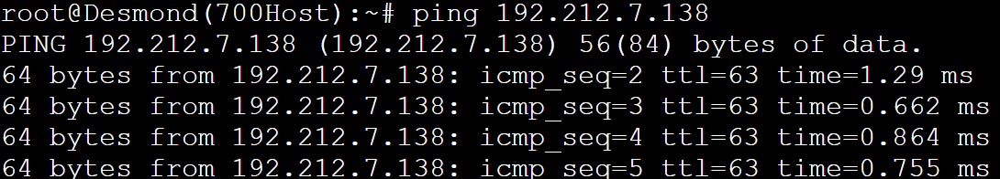

# Jarkom-Modul-5-ITA04-2022
Nama Anggota | NRP
------------------- | --------------		
Nida'ul Faizah | 5027201064
Kevin Oktoaria | 5027201046
Najwa Amelia Qorry 'Aina | 5027201001

## Soal
### Soal A
Membuat topologi jaringan sesuai rancangan Loid pada GNS3, beserta pembagian subnetnya sebagai berikut:


### Soal B
Membuat topologi di atas menggunakan teknik VLSM setelah melakukan subnetting dengan hasil perhitungan jumlah host pada setiap subnet dan netmask berapa yang akan digunakan yang kami dapatkan adalah:


### Soal C
Melakukan routing agar setiap perangkat pada jaringan tersebut dapat terhubung. Pertama kami melakukan konfigurasi IP sesuai table perhitungan vlsm di atas. Misal pada Subnet A1:
```
Subnet A1 : 
    NID : 192.212.7.128
    Netmask : 255.255.255.248
    IP range : 192.212.7.129 - 192.212.7.134
```
Sehingga untuk konfigurasi setiap nodenya adalah seperti berikut:
I##### Strix
```
auto eth0
iface eth0 inet dhcp

auto eth1
iface eth1 inet static
	address 192.212.7.145
	netmask 255.255.255.252

auto eth2
iface eth2 inet static
	address 192.212.7.149
	netmask 255.255.255.252
```
##### Ostania
```
auto eth0
iface eth0 inet static
	address 192.212.7.146
	netmask 255.255.255.252
        gateway 192.212.7.145

auto eth1
iface eth1 inet static
	address 192.212.7.129
	netmask 255.255.255.248

auto eth2
iface eth2 inet static
	address 192.212.6.1
	netmask 255.255.255.0

auto eth3
iface eth3 inet static
	address 192.212.4.1
	netmask 255.255.254.0
```
##### MainGate
```
auto eth0
iface eth0 inet static
	address 192.212.7.130
	netmask 255.255.255.248
    gateway 192.212.7.129
```
#### Garden
```
auto eth0
iface eth0 inet static
	address 192.212.7.131
	netmask 255.255.255.248
    gateway 192.212.7.129
```
#### Westalis
```
auto eth0
iface eth0 inet static
	address 192.212.7.150
	netmask 255.255.255.252
        gateway 192.212.7.149

auto eth1
iface eth1 inet static
	address 192.212.7.137
	netmask 255.255.255.248

auto eth2
iface eth2 inet static
	address 192.212.7.1
	netmask 255.255.255.128

auto eth3
iface eth3 inet static
	address 192.212.0.1
	netmask 255.255.252.0
```
#### Eden
```
auto eth0
iface eth0 inet static
	address 192.212.7.139
	netmask 255.255.255.248
    gateway 192.212.7.137
```
#### Wise
```
auto eth0
iface eth0 inet static
	address 192.212.7.138
	netmask 255.255.255.248
    gateway 192.212.7.137
```
##### Forger, Desmond, Blackball, Briar
```
auto eth0
iface eth0 inet dhcp
```

Forger, Desmond, Blackball, Briar akan mendapatkan IP secara dinamis dari DHCP server. Kemudian kami melakukan routing, dari topologi karena A7, A8, A6 sudah terbuhung dengan Westalis dan A2, A3, A1 juga telah terhubung dengan Ostania, maka hanya perlu melakukan settingan routing pada Strix agar semua subnet yang terhubung ke Westalis dan Ostania serta Strix dengan cara seperti berikut:
```
route add -net 192.212.7.136 netmask 255.255.255.248 gw 192.212.7.150
route add -net 192.212.7.0 netmask 255.255.255.128 gw 192.212.7.150
route add -net 192.212.0.0 netmask 255.255.252.0 gw 192.212.7.150

route add -net 192.212.7.128 netmask 255.255.255.248 gw 192.212.7.146
route add -net 192.212.6.0 netmask 255.255.255.0 gw 192.212.7.146
route add -net 192.212.4.0 netmask 255.255.254.0 gw 192.212.7.146
```

### Soal D
Setelah melakukan Routing, perlu memberikan ip pada subnet Forger, Desmond, Blackbell, dan Briar secara dinamis menggunakan bantuan DHCP server (setting DHCP Relay pada router yang menghubungkannya) dengan menjalankan command berikut:
#### Westalis, Ostania, Strix
```
apt-get install isc-dhcp-relay -y
service isc-dhcp-relay restart
```

Ketika menjalankan command tersebut, server, interface, dan option diisi seperti berikut:
```
SERVERS="192.212.7.138"
INTERFACES="eth2 eth1 eth3 eth0"
OPTIONS=""
```

Kemudian pada Wise dijalankan command berikut untuk mendownload DHCP server dan mengatur interfacenya:
```
apt-get install isc-dhcp-server -y

echo "
INTERFACES=\"eth0\"
" > /etc/default/isc-dhcp-server
```

Setelah itu barulah mengatur IP terhadap setiap subnet yang ada sebagai berikut:
```
echo "
ddns-update-style none;
option domain-name \"example.org\";
option domain-name-servers ns1.example.org, ns2.example.org;
default-lease-time 600;
max-lease-time 7200;
log-facility local7;
subnet 192.212.7.136 netmask 255.255.255.248{}
subnet 192.212.7.0 netmask 255.255.255.128 {
   range 192.212.7.2 192.212.7.126;
   option routers 192.212.7.1;
   option broadcast-address 192.212.7.127;
   option domain-name-servers 192.212.7.139;
   default-lease-time 360;
   max-lease-time 7200;
}

subnet 192.212.0.0 netmask 255.255.252.0 {
   range 192.212.0.2 192.212.3.254;
   option routers 192.212.0.1;
   option broadcast-address 192.212.3.255;
   option domain-name-servers 192.212.7.139;
   default-lease-time 360;
   max-lease-time 7200;
}

subnet 192.212.4.0 netmask 255.255.254.0 {
   range 192.212.4.2 192.212.5.254;
   option routers 192.212.4.1;
   option broadcast-address 192.212.5.255;
   option domain-name-servers 192.212.7.139;
   default-lease-time 360;
   max-lease-time 7200;
}

subnet 192.212.6.0 netmask 255.255.255.0 {
   range 192.212.6.2 192.212.6.254;
   option routers 192.212.6.1;
   option broadcast-address 192.212.6.255;
   option domain-name-servers 192.212.7.139;
   default-lease-time 360;
   max-lease-time 7200;
}

" > /etc/dhcp/dhcpd.conf
service isc-dhcp-server restart
```

Lalu karena disini Eden sebagai DNS, maka perlu membuat DNS Forwarder agar setiap subnet dapat terhubung ke internet dengan command berikut:

```
apt-get install bind9 -y

echo "
options {
        directory \"/var/cache/bind\";
        forwarders {
                192.168.122.1;
        };
        allow-query{any;};
        auth-nxdomain no;
        listen-on-v6 { any; };
};

" > /etc/bind/named.conf.options
service bind9 restart
```

### Soal 1
Agar topologi yang kalian buat dapat mengakses keluar, kalian diminta untuk mengkonfigurasi Strix menggunakan iptables, tetapi Loid tidak ingin menggunakan MASQUERADE.

#### Jawab
Melakukan konfigurasi pada Strix seperti berikut:
```
ipEth0="$(ip -br a | grep eth0 | awk '{print $NF}' | cut -d'/' -f1)"

iptables -t nat -A POSTROUTING -s 192.212.0.0/21 -o eth0 -j SNAT --to-source "$ipEth0"
```

#### Testing
Mencoba ping dari salah satu node


### Soal 2
Kalian diminta untuk melakukan drop semua TCP dan UDP dari luar Topologi kalian pada server yang merupakan DHCP Server demi menjaga keamanan.

#### Jawab
Menjalankan command pada Strix seperti berikut agar semua paket TCP yang menuju 192.212.7.136/29 dan melalui eth0 menuju port 80 akan di drop:
```
iptables -A FORWARD -d 192.212.7.136/29 -i eth0 -p tcp --dport 80 -j DROP
```

### Soal 3
Loid meminta kalian untuk membatasi DHCP dan DNS Server hanya boleh menerima maksimal 2 koneksi ICMP secara bersamaan menggunakan iptables, selebihnya didrop.

#### Jawab
Menjalankan command berikut pada DHCP Server Wise:
```
iptables -A INPUT -p ICMP -m connlimit --connlimit-above 2 --connlimit-mask 0 -j DROP
```

Selanjutnya menjalankan command berikut untuk DNS Server Doriki:
```
iptables -A INPUT -p ICMP -m connlimit --connlimit-above 3 --connlimit-mask 0 -j DROP
```

#### Testing
Mencoba ping dari Forger dan Desmond



Pada node Blackbell sudah tidak dapat melakukan ping menuju 192.212.7.138 lagi


### Soal 4
Akses menuju Web Server hanya diperbolehkan disaat jam kerja yaitu Senin sampai Jumat pada pukul 07.00 - 16.00.

#### Jawab
Menjalankan command berikut pada Eden
```
iptables -A INPUT -s 192.212.7.136/29 -m time --timestart 07:00 --timestop 16:00 --weekdays Mon,Tue,Wed,Thu,Fri -j ACCEPT
iptables -A INPUT -s 192.212.7.136/29 -j REJECT
```

#### Testing
Mencoba ping pada IP yang telah diatur (atas) sudah tidak terkirim karena dibatasi dan mencoba ping pada IP yang lain (bawah)

